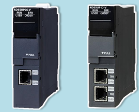

# citl_dtdl_poc
Mitsubishi CITL -- C Language Intelligent Function for iQ-R 

The C intelligent function module realizes data processing and numerical analysis processing which are difficult in ladder form.

--Example of Ladder Logic --

